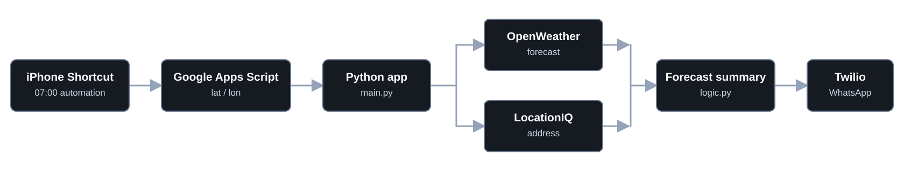
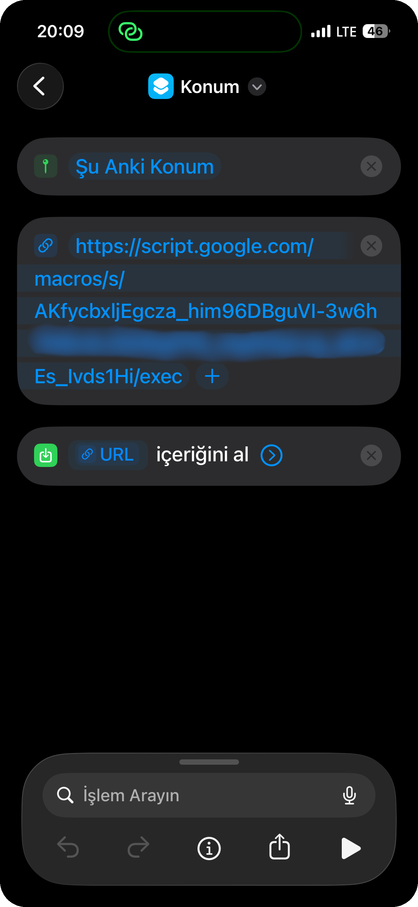
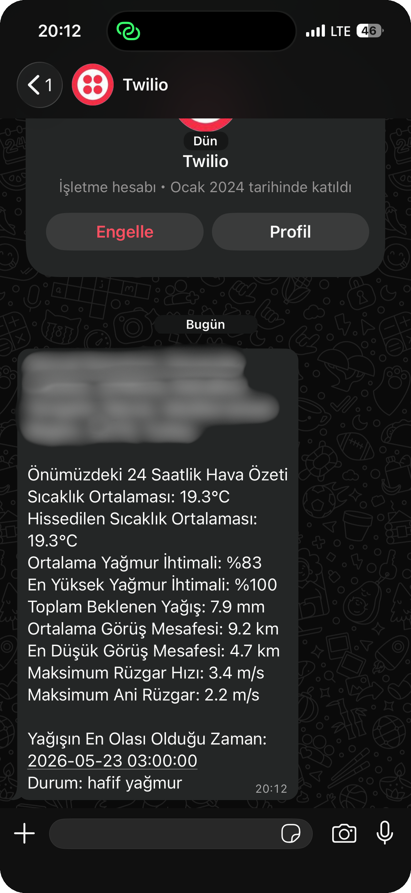

# Weather Alert Service

<p align="center">
  
</p>


Weather Alert Service is a Python application that creates a location-based
weather summary for the next 24 hours and sends it as a WhatsApp message.

An iPhone Shortcut automation sends the user's current coordinates to a Google
Apps Script endpoint every morning at 07:00. The application reads those
coordinates, retrieves forecast data from OpenWeather, resolves the coordinates
to a readable address with LocationIQ, and delivers the final summary through
Twilio WhatsApp.

## Visual Overview



## About

This project focuses on a simple daily question: what weather conditions should
matter before leaving home?

Instead of showing raw forecast data, it turns the next 24 hours of forecast
entries into a short message with:

- Current location
- Average temperature and feels-like temperature
- Average and maximum precipitation probability
- Expected rainfall total
- Average and minimum visibility
- Maximum wind speed and wind gust
- The forecast time with the highest precipitation probability

## How It Works

1. An iPhone Shortcut automation captures the user's location every morning at
   07:00.
2. The shortcut sends latitude and longitude values to the configured Google
   Apps Script endpoint.
3. `main.py` reads the coordinates from Google Apps Script.
4. The coordinates are sent to OpenWeather to fetch forecast data.
5. The same coordinates are sent to LocationIQ to create a readable address.
6. `logic.py` summarizes the next eight forecast entries, representing the next
   24 hours in the current implementation.
7. Twilio sends the generated summary as a WhatsApp message.

## Features

- Location-aware weather summaries
- Turkish weather descriptions from OpenWeather
- 24-hour forecast aggregation
- WhatsApp delivery through Twilio
- Focused metrics for rain, visibility, temperature, and wind

## Preview

<p align="center">
  
  
</p>

## Getting Started

### Prerequisites

- Python 3
- OpenWeather API key
- LocationIQ API token
- Twilio account credentials with WhatsApp messaging configured
- An iPhone Shortcut automation that sends the user's location every morning at
  07:00
- A Google Apps Script endpoint that returns the current `lat` and `lon`
  values sent by the shortcut after receiving the configured secret

### Installation

Clone the repository and open the project directory:

```bash
git clone https://github.com/your-username/weather-alert-service.git
cd weather-alert-service
```

Create and activate a virtual environment:

```bash
python3 -m venv .venv
source .venv/bin/activate
```

Install dependencies:

```bash
pip install -r requirements.txt
```

## Configuration

Create a `.env` file in the project root:

```env
API_KEY=your_openweather_api_key
LOCATION_IQ_TOKEN=your_locationiq_token
TWILIO_ACCOUNT_SID=your_twilio_account_sid
TWILIO_AUTH_TOKEN=your_twilio_auth_token
SECRET=your_google_apps_script_secret
```

The current implementation also keeps the Google Apps Script URL, Twilio
WhatsApp sender, and recipient number in `main.py`.

## Run

Run the application from the project root:

```bash
python3 main.py
```

When the API calls succeed, the application creates the weather summary and
sends it to the configured WhatsApp recipient.

## Project Structure

```text
.
|-- assets/
|   |-- banners/
|   |   `-- weather-alert-ascii.png
|   |-- previews/
|   |   |-- iphone-shortcuts.png
|   |   `-- whatsapp-summary.png
|   `-- weather-flow.svg # Static workflow diagram for the README
|-- logic.py          # Forecast and location summary logic
|-- main.py           # API calls, message building, and WhatsApp delivery
|-- requirements.txt  # Python dependencies
`-- README.md
```

## License

This project is licensed under the MIT License. See `LICENSE` for details.
